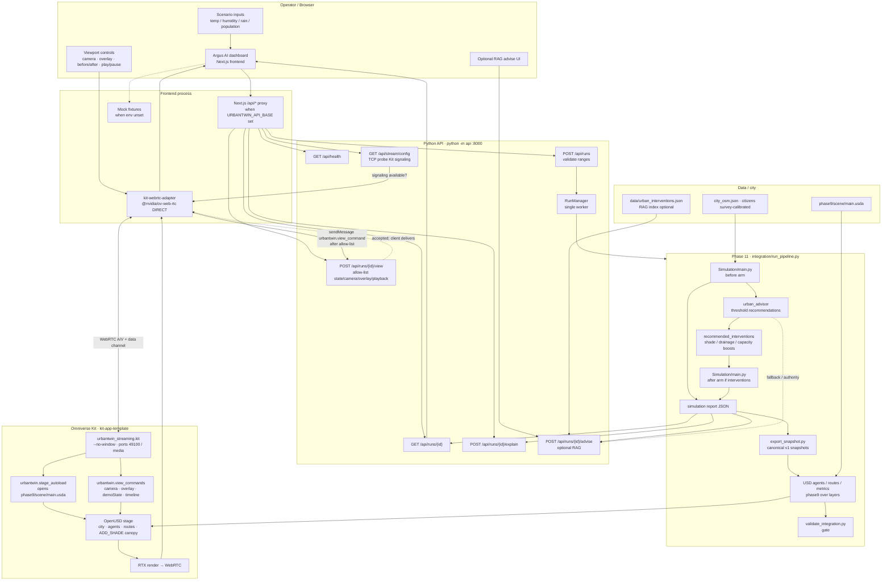
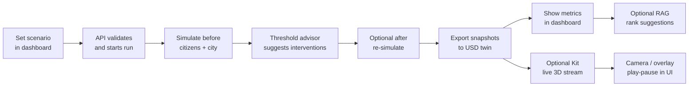

# Argus AI — end-to-end pipeline

How a scenario becomes metrics, USD, and (optionally) a live Omniverse stream.

## Slide-friendly summary (copy into a deck)

### One-line story

**You set a city scenario → Argus simulates people → it suggests fixes → you see results in the dashboard and optionally in a live 3D city.**

### Steps (keep this order on the slide)

1. **You choose conditions** — temperature, humidity, rain, population in the Argus AI dashboard.
2. **Live API accepts the run** — checks ranges, then starts one simulation job.
3. **Simulator runs “before”** — synthetic citizens pick routes on the real OSM city under that weather and crowding.
4. **Built-in advisor scores stress** — if heat / rain / crowding cross fixed thresholds, it suggests shade, drainage, or extra pedestrian capacity (no LLM required).
5. **Optional “after” re-sim** — applies those interventions and compares before vs after metrics.
6. **Export to the 3D twin** — report → canonical snapshots → USD agents, routes, and the shade canopy proposal.
7. **Dashboard shows impact** — headline metrics, problem areas, recommendations.
8. **Optional live 3D** — Kit streams the RTX view into the browser; camera / overlay / play-pause are allow-listed then sent to Kit.
9. **Optional RAG advisor** — ranks grounded suggestions among the same executable actions; the simulator advisor stays the authority for what actually runs.

### What each box means (glossary for speakers)

| Piece | Plain language |
| --- | --- |
| Dashboard | Web UI operators use (Argus AI). |
| API | Local Python server that runs sims and validates commands. |
| Simulator | Deterministic pedestrian / stress model in `Simulation/`. |
| Threshold advisor | Rules like “heat ≥ 60 → suggest more shade”. |
| Snapshot / USD | Numbers and people placed into the Omniverse city file. |
| Kit streaming | Headless Omniverse app that renders and WebRTC-streams the view. |
| RAG advise | Optional LLM ranking over a local knowledge base — cannot invent new action types. |

### Integrity lines (use on the slide footer)

- Metrics are **heuristic prototypes**, not medical or engineering forecasts.
- Citizens are **survey-calibrated**; scenario factors are confounded.
- Shade canopy in 3D is a **proposal visualization**; drainage may improve metrics without a new 3D asset.

---

## Mermaid diagram (render in GitHub / Mermaid Live / Notion)

### Simplified Mermaid (better for a single slide)

---

## Related docs

- Root [`README.md`](../README.md) — launch and verification
- [`DEMO_RUNBOOK.md`](DEMO_RUNBOOK.md) — operator demo
- [`INTEGRATION_CONTRACT.md`](INTEGRATION_CONTRACT.md) — snapshot contract
